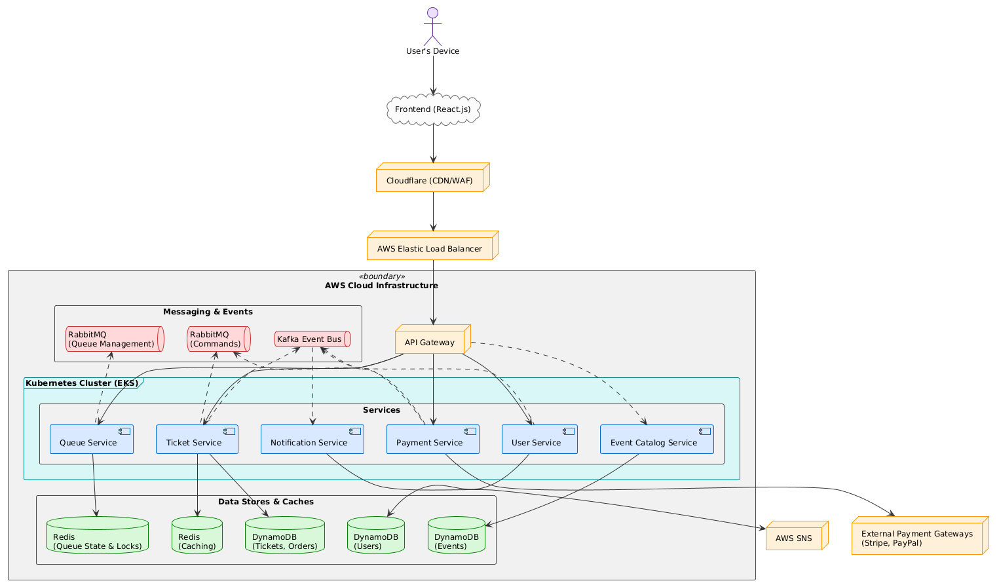
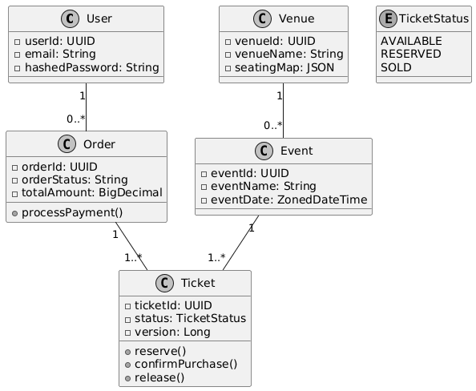
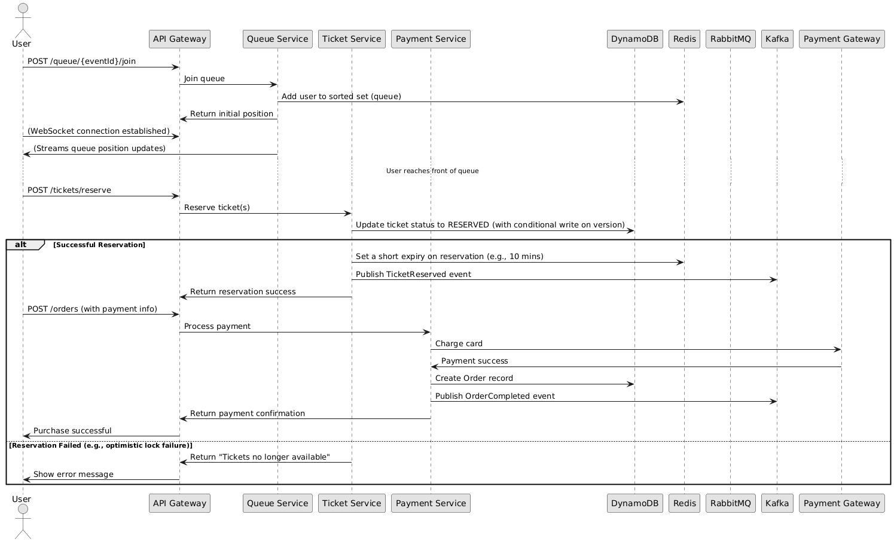
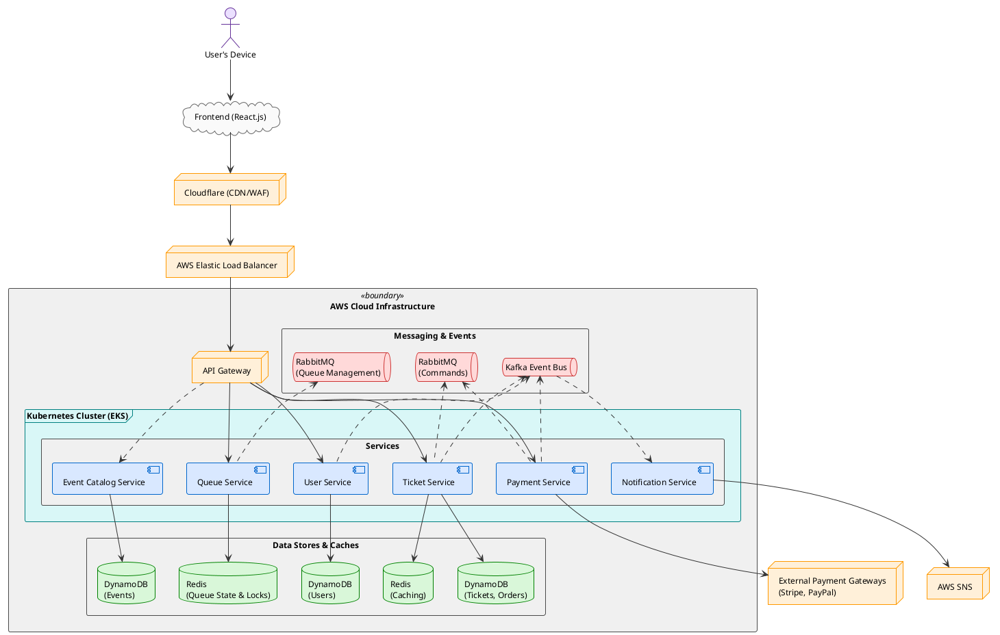
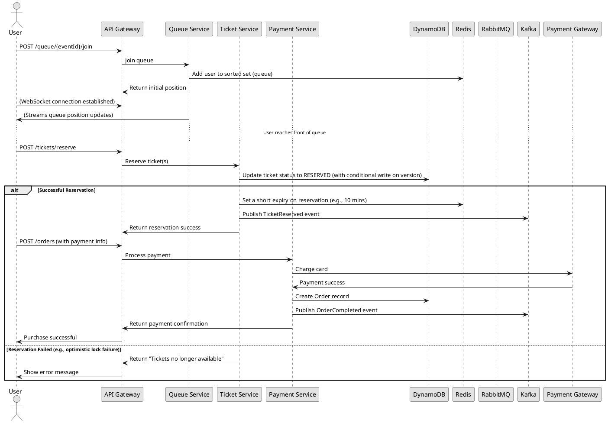

# Project Documentation: A High-Performance, Event Ticketing Platform

**Version:** 1.0
**Date:** September 05, 2025
**Author:** Nevil Maloba

---

### **Table of Contents**

1.  [**Part A: Introduction & Vision**](#part-a-introduction--vision)
    * [1.1 Project Overview](#11-project-overview)
    * [1.2 Problem Statement](#12-problem-statement)
    * [1.3 Vision and Goals](#13-vision-and-goals)
    * [1.4 Scope and Key Deliverables](#14-scope-and-key-deliverables)

2.  [**Part B: System Specification & Requirements**](#part-b-system-specification--requirements)
    * [2.1 Overall System Description](#21-overall-system-description)
        * [2.1.1 Product Perspective & System Interfaces](#211-product-perspective--system-interfaces)
        * [2.1.2 User Characteristics](#212-user-characteristics)
    * [2.2 Functional Requirements (FRs)](#22-functional-requirements-frs)
    * [2.3 Non-Functional Requirements (NFRs)](#23-non-functional-requirements-nfrs)
    * [2.4 Use Case Modeling](#24-use-case-modeling)

3.  [**Part C: System Architecture & Design**](#part-c-system-architecture--design)
    * [3.1 Overall System Architecture](#31-overall-system-architecture)
        * [3.1.1 Architectural Style & Justification](#311-architectural-style--justification)
        * [3.1.2 High-Level Architectural Diagram](#312-high-level-architectural-diagram)
    * [3.2 Core Domain Model & Design](#32-core-domain-model--design)
        * [3.2.1 Core Entities and Relationships](#321-core-entities-and-relationships)
        * [3.2.2 Class Diagram](#322-class-diagram)
    * [3.3 Data Persistence Layer Design](#33-data-persistence-layer-design)
    * [3.4 API / Service Layer Design](#34-api--service-layer-design)
        * [3.4.1 API Design Principles](#341-api-design-principles)
        * [3.4.2 Key Endpoints and Services](#342-key-endpoints-and-services)
        * [3.4.3 Sequence Diagram for Ticket Purchase Flow](#343-sequence-diagram-for-ticket-purchase-flow)

4.  [**Part D: Cross-Cutting Concerns Design**](#part-d-cross-cutting-concerns-design)
    * [4.1 Concurrency Control Strategy](#41-concurrency-control-strategy)
        * [4.1.1 Fine-Grained and Pessimistic Locking](#411-fine-grained-and-pessimistic-locking)
        * [4.1.2 Optimistic Locking with Versioning](#412-optimistic-locking-with-versioning)
        * [4.1.3 Distributed Locking with Redis](#413-distributed-locking-with-redis)
    * [4.2 Fault Tolerance and Resilience](#42-fault-tolerance-and-resilience)
        * [4.2.1 Retry Mechanisms with Exponential Backoff](#421-retry-mechanisms-with-exponential-backoff)
        * [4.2.2 Circuit Breaker Pattern](#422-circuit-breaker-pattern)
    * [4.3 Security by Design](#43-security-by-design)
    * [4.4 Logging and Monitoring](#44-logging-and-monitoring)

5.  [**Part E: Execution & Operations Plan**](#part-e-execution--operations-plan)
    * [5.1 Implementation Plan](#51-implementation-plan)
        * [5.1.1 Development Environment and Tools](#511-development-environment-and-tools)
        * [5.1.2 Implementation Phases](#512-implementation-phases)
    * [5.2 Quality Assurance & Testing Strategy](#52-quality-assurance--testing-strategy)
        * [5.2.1 Levels and Types of Testing](#521-levels-and-types-of-testing)
        * [5.2.2 Test Tools and Frameworks](#522-test-tools-and-frameworks)
    * [5.3 Deployment and Operations Plan](#53-deployment-and-operations-plan)
        * [5.3.1 Deployment Strategy](#531-deployment-strategy)
        * [5.3.2 Monitoring and Maintenance](#532-monitoring-and-maintenance)

6.  [**Part F: Risk Management and Future Work**](#part-f-risk-management-and-future-work)
    * [6.1 Risk Management and Mitigation](#61-risk-management-and-mitigation)
    * [6.2 Potential Future Enhancements](#62-potential-future-enhancements)

---

## **Part A: Introduction & Vision**

### **1.1 Project Overview**

This document outlines the comprehensive design, architecture, and implementation plan for a highly scalable, resilient, and Event Management System (EMS). The platform is engineered to handle massive, concurrent demand for ticket sales across a wide spectrum of events, including major concerts, international sporting events, theater productions, and conferences.

Built on a modern, reactive technology stack featuring the Spring Framework (Spring Boot, WebFlux) and Java 21's virtual threads, the system is designed from the ground up to address the inherent challenges of high-traffic online ticketing. By leveraging a microservices architecture, advanced messaging queues (RabbitMQ), event streaming platforms (Apache Kafka), and a robust cloud infrastructure on Amazon Web Services (AWS), the EMS aims to provide a seamless, reliable, and fair user experience, even during peak load periods where millions of users may attempt to purchase tickets simultaneously.

### **1.2 Problem Statement**

The online ticketing industry is plagued by a common set of critical challenges that frequently lead to poor customer experiences and lost revenue for event organizers. These problems are most acute for high-demand events, where traffic can spike by orders of magnitude within seconds of tickets going on sale.

The primary challenges include:
* **System Overload and Crashes:** Traditional monolithic, blocking architectures cannot handle the sudden influx of millions of concurrent requests, leading to server crashes, slow response times, and a frustrating user experience.
* **Race Conditions and Overselling:** Without robust concurrency control, multiple users can attempt to purchase the same ticket simultaneously, leading to overselling, data inconsistencies, and subsequent customer service nightmares.
* **Unfair Ticket Allocation:** The "fastest finger first" approach often favors bots and scalpers, leaving genuine fans empty-handed. A lack of a fair queuing mechanism exacerbates this issue.
* **Lack of Real-Time Information:** Users are often left in the dark about their position in a queue or the real-time availability of tickets, leading to uncertainty and frustration.
* **Scalability and Cost Inefficiency:** Systems that are not designed for the cloud cannot dynamically scale to meet peak demand, requiring costly over-provisioning of hardware that sits idle most of the time.

### **1.3 Vision and Goals**

The vision for the EMS is to become a benchmark for high-performance, resilient, and equitable online ticketing. We aim to create a platform that event organizers can trust to handle their most popular events and that fans can rely on for a smooth and fair purchasing experience.

The primary goals of this project are:
1.  **High Concurrency and Performance:** To support over one million concurrent users with a target throughput of 50,000 requests per second, maintaining an average response time of under one second.
2.  **System Resilience and Reliability:** To achieve 99.9% uptime through a fault-tolerant architecture that includes circuit breakers, automated failover, and robust retry mechanisms.
3.  **Fair and Orderly Access:** To implement a sophisticated virtual queue system that manages user access during peak periods, prevents system overload, and provides users with transparent, real-time status updates.
4.  **Data Integrity and Consistency:** To guarantee that tickets are never oversold by employing a multi-layered concurrency control strategy, including optimistic and pessimistic locking, distributed locks, and atomic operations.
5.  **Scalability and Elasticity:** To build a cloud-native application that can automatically scale resources up and down based on demand, optimizing for both performance and cost.
6.  **Generalization and Flexibility:** To design a platform that is not tied to a specific type of event, allowing it to be easily configured for concerts, sports, theater, and more, with customizable seating maps, pricing tiers, and event rules.

### **1.4 Scope and Key Deliverables**

The scope of this project encompasses the end-to-end design, development, and deployment of the backend systems required for the ticketing platform.

**In Scope:**
* A suite of reactive microservices for user management, event catalog, virtual queue, ticketing, payments, and notifications.
* Integration with third-party payment gateways (e.g., Stripe, PayPal).
* Implementation of a dual-messaging system using RabbitMQ for transactional messages and Kafka for event streaming.
* A robust data persistence layer using NoSQL (Amazon DynamoDB) and in-memory caching (Redis).
* A comprehensive testing strategy, including unit, integration, performance, and security testing.
* Deployment automation using Docker, Kubernetes, and a CI/CD pipeline.

**Out of Scope (for this initial version):**
* The frontend user interface (a React.js frontend is assumed and will interact with the APIs defined in this document).
* Secondary ticket resale marketplace features.
* Advanced analytics and reporting dashboards for event organizers (though the architecture will support this in the future).

**Key Deliverables:**
1.  This detailed project documentation.
2.  Fully implemented and tested backend microservices.
3.  OpenAPI (Swagger) documentation for all public-facing APIs.
4.  A suite of automated tests with at least 80% code coverage.
5.  Kubernetes deployment scripts and a Jenkins CI/CD pipeline configuration.

---

## **Part B: System Specification & Requirements**

### **2.1 Overall System Description**

#### **2.1.1 Product Perspective & System Interfaces**

The Event Management System (EMS) is a headless, API-first platform designed to serve as the backbone for a modern, large-scale ticketing operation. It is architected as a set of reactive, distributed services that communicate asynchronously, ensuring high throughput and low latency.

**System Interfaces:**
* **Frontend Application:** The system will expose a set of RESTful and WebSocket APIs to be consumed by a client-side application (e.g., a React/Angular single-page application or a native mobile app).
* **Payment Gateways:** It will integrate with leading payment providers like Stripe and PayPal via their respective APIs to process transactions securely and reactively. The payment service will abstract the complexities of these integrations.
* **Notification Services:** For sending real-time confirmations (e.g., email, SMS), the system will integrate with AWS Simple Notification Service (SNS), allowing for flexible and scalable notification delivery.
* **Content Delivery Network (CDN):** While the backend itself serves dynamic data, it is designed to work in concert with a CDN like Cloudflare, which would be responsible for serving the frontend application's static assets and providing an initial layer of DDoS protection.
* **Message Brokers:** The system uses two distinct messaging brokers for different purposes:
    * **RabbitMQ:** Used for command-based, immediate tasks such as managing user positions in the virtual queue and handling payment processing requests. Its AMQP protocol ensures reliable, point-to-point message delivery.
    * **Apache Kafka:** Used as a distributed event log for event sourcing and stream processing. All significant state changes in the system (e.g., `OrderCreated`, `TicketReserved`, `PaymentCompleted`) will be published as events to Kafka topics, creating an immutable audit trail and enabling other services to react to these events.

#### **2.1.2 User Characteristics**

The platform is designed to serve a diverse user base with varying levels of technical proficiency.
* **Primary Users (Ticket Buyers):** This group includes a wide demographic (e.g., aged 16-60) from various backgrounds. A significant portion (estimated 70-80%) will access the platform via mobile devices. The user interface they interact with must be intuitive, accessible (WCAG 2.1 compliant), and multilingual to cater to a global audience.
* **Secondary Users (Event Organizers/Administrators):** This is a more technically proficient group responsible for setting up events, managing ticket inventory, defining pricing, and monitoring sales. They will interact with the system through a dedicated admin interface or API.

### **2.2 Functional Requirements (FRs)**

| ID | Requirement | Priority |
| :--- | :--- | :--- |
| **FR1** | **User Authentication:** Users must be able to register and log in using email/password or social logins (e.g., Google, Facebook). | High |
| **FR2** | **Event Catalog:** The system shall display a browsable catalog of upcoming events with details such as date, time, venue, and ticket prices. | High |
| **FR3** | **Virtual Queue:** During high-demand sales, the system must place users into a virtual waiting room to manage traffic flow to the purchase page in a fair, first-in-first-out manner. Users must see their real-time queue position. | Critical |
| **FR4** | **Rate Limiting & Security:** The system must implement rate limiting and CAPTCHA challenges (e.g., hCaptcha) to protect against bots and denial-of-service attacks. | Critical |
| **FR5** | **Real-Time Inventory Display:** The system shall display real-time ticket availability for an event, updating dynamically as tickets are reserved and purchased. This will be facilitated via WebSocket connections. | High |
| **FR6** | **Seat Selection:** For seated events, the system shall provide an interactive seating map allowing users to select specific seats. For general admission events, users will select the quantity of tickets. | High |
| **FR7** | **Secure Payment Processing:** The system must securely process payments by integrating with external payment gateways. It must not store raw credit card information. | Critical |
| **FR8** | **Order Confirmation:** Upon successful payment, the system must send an order confirmation to the user via email or SMS and display the tickets in their user profile. | High |
| **FR9** | **Admin Dashboard Functionality:** Administrators must be able to create and manage events, define ticket types and prices, view sales reports, and monitor system health. | Medium |

### **2.3 Non-Functional Requirements (NFRs)**

| Category | Requirement |
| :--- | :--- |
| **Performance** | **Response Time:** <1 second response time for 95% of all API requests under normal load. <2 seconds during peak load.   **Throughput:** Capable of handling a sustained load of 50,000 requests per second during peak sales events. |
| **Scalability** | **Concurrency:** Must support 1 million+ concurrent users actively engaged with the system (i.e., in the queue, browsing, or purchasing).   **Elasticity:** The system must automatically scale its compute and database resources based on real-time traffic, leveraging Kubernetes Horizontal Pod Autoscaling. |
| **Reliability** | **Uptime:** 99.9% availability (approximately 8.76 hours of downtime per year).   **Failover:** Automated failover for all critical components (services, databases, message brokers) with a recovery time objective (RTO) of less than 5 minutes. |
| **Security** | **Data Protection:** All data in transit must be encrypted using TLS 1.3. Sensitive data at rest must be encrypted.   **Compliance:** The payment processing flow must be PCI DSS compliant.   **Access Control:** Role-Based Access Control (RBAC) for all administrative functions. |
| **Usability** | **Accessibility:** Frontend interfaces consuming the API should be designed to meet WCAG 2.1 AA standards.   **Responsiveness:** The system must perform consistently across various devices, with a focus on mobile-first design principles. |
| **Maintainability**| **Modularity:** The system will be composed of independent microservices with well-defined APIs.   **Testability:** Target a minimum of 80% unit test coverage and 70% integration test coverage. |

### **2.4 Use Case Modeling**

* **Actors:** User (Ticket Buyer), Administrator, Payment Gateway, Notification Service.
* **Primary Use Cases:**
    * **UC1: User Registration and Login:** A user creates an account or logs into an existing one.
    * **UC2: Browse and Select Event:** A user browses the list of available events and selects one to view details.
    * **UC3: Join Queue and Purchase Ticket:** A user joins the virtual queue for a high-demand event, waits for their turn, selects tickets, provides payment information, and completes the purchase.
    * **UC4: Manage Events (Admin):** An administrator creates, updates, or deletes an event listing, manages ticket inventory, and sets pricing.

---

## **Part C: System Architecture & Design**

### **3.1 Overall System Architecture**

#### **3.1.1 Architectural Style & Justification**

The EMS is designed using a **Reactive Microservices Architecture**. This style is chosen specifically to meet the demanding non-functional requirements of high concurrency, low latency, and resilience.

**Justification:**
* **Reactivity:** The entire system is built on the principles of the Reactive Manifesto (responsive, resilient, elastic, and message-driven). By using Spring WebFlux with Project Reactor, we employ a non-blocking, asynchronous model. This allows the system to handle a massive number of concurrent connections with a small number of threads, as threads are not blocked waiting for I/O operations (e.g., database queries, network calls). The introduction of **Java 21's Virtual Threads** further enhances this, allowing us to write simple, imperative-style code that runs on lightweight, scalable threads managed by the JVM, giving us the best of both worlds: developer-friendly code and extreme scalability.
* **Microservices:** Decomposing the system into small, independent services (e.g., `user-service`, `queue-service`, `ticket-service`) provides several advantages:
    * **Independent Scaling:** Each service can be scaled independently. For example, during a ticket sale, the `queue-service` and `ticket-service` can be scaled up aggressively without needing to scale the less-used `event-catalog-service`.
    * **Technology Heterogeneity:** While our primary stack is Spring Boot, a microservice architecture allows for using different technologies for specific services if needed in the future.
    * **Fault Isolation:** A failure in one service (e.g., the notification service) will not cascade and bring down the entire system. The circuit breaker pattern will isolate failures gracefully.
* **Dual-Event-Bus Model:** The strategic use of both RabbitMQ and Kafka is a cornerstone of this design.
    * **RabbitMQ for Queues/Commands:** It excels at managing the virtual queue, where fairness (first-in, first-out) and guaranteed delivery of individual commands (e.g., "process this user's entry") are paramount.
    * **Kafka for Event Streaming:** It serves as the system's central nervous system, providing a durable, replayable log of all business events. This enables event sourcing, real-time analytics, and decouples services, as consumers can subscribe to event streams without the producer needing to know about them.

#### **3.1.2 High-Level Architectural Diagram**

### **3.2 Core Domain Model & Design**

#### **3.2.1 Core Entities and Relationships**

  * **User:** Represents a customer. Contains personal details and authentication information. A user can have many orders.
  * **Event:** Represents an event for which tickets are sold (e.g., a concert, a match). Contains details like name, date, and venue. An event has many tickets.
  * **Venue:** Represents the location of the event. Can have predefined seating maps.
  * **Ticket:** Represents a single ticket for a specific event. It has a status (`AVAILABLE`, `RESERVED`, `SOLD`) and a version number for optimistic locking.
  * **Order:** Represents a transaction where a user purchases one or more tickets. It is linked to the user, the tickets, and the payment transaction.
  * **QueuePosition:** A transient object representing a user's place in the virtual queue for a specific event.

#### **3.2.2 Class Diagram**

### **3.3 Data Persistence Layer Design**

  * **Primary Database (Amazon DynamoDB):** A NoSQL, key-value database is chosen for its immense scalability, low-latency performance, and flexible schema. It is ideal for the high-write throughput required during a ticket sale.
      * **Schema Design:** We will use single-table design principles where appropriate to minimize the number of queries. For example, `Orders` and `Tickets` might be stored in the same table with different primary key patterns.
      * **Conditional Writes:** DynamoDB's conditional write feature will be the cornerstone of our optimistic locking strategy, allowing us to update an item only if its version number matches.
  * **In-Memory Cache & Lock Manager (Redis):** An in-memory data store is used for tasks requiring microsecond latency.
      * **Caching:** Caching frequently accessed, semi-static data like event details or venue seating maps to reduce load on DynamoDB.
      * **Distributed Locks:** Implementing a distributed locking mechanism (e.g., Redlock algorithm) for critical sections where we need to ensure only one service instance can operate on a resource at a time.
      * **Queue State:** Managing the state of the virtual queue, such as user positions and queue entry/exit times.

### **3.4 API / Service Layer Design**

#### **3.4.1 API Design Principles**

  * **Reactive & Non-Blocking:** All API endpoints will be implemented using Spring WebFlux, returning `Mono` (for single items) or `Flux` (for streams of items) to ensure the request-handling thread is never blocked.
  * **RESTful and Stateless:** Services will communicate via standard HTTP verbs and status codes. All services will be stateless, allowing for easy horizontal scaling.
  * **WebSocket for Real-Time Communication:** For features requiring real-time updates, such as queue position and live ticket availability, we will use WebSocket endpoints to push data from the server to the client efficiently.

#### **3.4.2 Key Endpoints and Services**

  * **`queue-service`**
      * `POST /api/v1/queue/{eventId}/join`: Allows a user to join the queue for an event. Returns their initial position.
      * `GET /ws/v1/queue/{userId}/status`: A WebSocket endpoint that streams a user's current queue position and estimated wait time.
  * **`ticket-service`**
      * `POST /api/v1/tickets/reserve`: Attempts to reserve a set of tickets for a user. This is a critical, high-contention endpoint. It initiates the purchase flow.
      * `POST /api/v1/orders`: Creates an order based on reserved tickets and proceeds to payment.
  * **`payment-service`**
      * `POST /api/v1/payments/process`: Receives payment details, communicates with the external payment gateway, and publishes a `PaymentCompleted` or `PaymentFailed` event.

#### **3.4.3 Sequence Diagram for Ticket Purchase Flow**

-----

## **Part D: Cross-Cutting Concerns Design**

### **4.1 Concurrency Control Strategy**

This is the most critical aspect of the system design to prevent overselling. We will use a multi-layered approach.

#### **4.1.1 Fine-Grained and Pessimistic Locking**

While the system is largely non-blocking, there are moments where exclusive access to a resource (a single ticket) is required.

  * **Pessimistic Locking (Database Level):** For RDBMS like PostgreSQL, this would involve using `SELECT ... FOR UPDATE`. In DynamoDB, we can achieve a similar effect using **Transactions**. A DynamoDB transaction can group multiple actions (e.g., read a ticket's status and update it to `RESERVED`) into a single, all-or-nothing operation, ensuring atomicity. This is used as the final guarantee of correctness but can be slower than optimistic approaches.

#### **4.1.2 Optimistic Locking with Versioning**

This will be our primary strategy for handling high-contention updates on tickets.

  * **Mechanism:** Each ticket item in DynamoDB will have a `version` attribute (a number).
    1.  When a service reads a ticket to reserve it, it also reads its current `version`.
    2.  When it attempts to write the `RESERVED` status back, it uses a **conditional update**, telling DynamoDB: "Only update this item if its `version` attribute is still the value I read."
    3.  As part of the update, it atomically increments the `version` number.
  * **Conflict Resolution:** If another process updated the ticket in the meantime, the condition will fail. The service will receive an error, at which point it knows the ticket was taken and can inform the user. This is highly efficient as it avoids expensive database locks.

#### **4.1.3 Distributed Locking with Redis**

Used for scenarios requiring coordination between different service instances, not just database rows.

  * **Example Use Case:** A promotional rule that allows only the first 1,000 users to get a discount. We can use a Redis distributed lock to protect a shared counter to ensure it's incremented atomically across the entire cluster.
  * **Implementation:** We will use a library like Redisson, which implements the Redlock algorithm, to acquire and release locks with a lease time. This prevents indefinite locking in case a service instance crashes.

### **4.2 Fault Tolerance and Resilience**

#### **4.2.1 Retry Mechanisms with Exponential Backoff**

Transient failures (e.g., temporary network glitches, a database node failover) are inevitable in a distributed system. Services must be able to recover from them.

  * **Implementation:** We will use the **Resilience4j** library. When a call to another service or database fails, instead of failing immediately, the system will automatically retry the operation.
  * **Exponential Backoff with Jitter:** Retries will not happen immediately. The delay between retries will increase exponentially (e.g., 100ms, 200ms, 400ms) with a small random "jitter" added. This prevents a "thundering herd" problem where all service instances retry at the exact same time, overwhelming the downstream service again.

#### **4.2.2 Circuit Breaker Pattern**

To prevent a single failing service from causing a cascading failure across the entire system.

  * **Mechanism (via Resilience4j):**
    1.  **Closed State:** Calls are permitted to the downstream service. Resilience4j monitors the number of failures.
    2.  **Open State:** If the failure rate exceeds a configured threshold (e.g., 50% of requests in a 1-minute window), the circuit breaker "opens." All subsequent calls to that service will fail immediately without even attempting the network call.
    3.  **Half-Open State:** After a cooldown period (e.g., 5 minutes), the circuit breaker enters a half-open state, allowing a limited number of test requests through. If they succeed, the circuit closes again. If they fail, it returns to the open state.
  * **Fallbacks:** For every circuit breaker, a fallback method will be defined. For instance, if the payment service is down, the fallback might be to save the order in a "pending payment" state and notify the user that they will be able to complete their purchase later.

### **4.3 Security by Design**

  * **Authentication:** Use OAuth 2.0 / OpenID Connect with JWTs for securing inter-service communication and user authentication.
  * **API Gateway Security:** The API Gateway will handle initial authentication, rate limiting, and apply web application firewall (WAF) rules.
  * **Principle of Least Privilege:** Each microservice will have IAM roles with the minimum permissions necessary to perform its function.
  * **Input Validation:** All incoming data will be strictly validated to prevent injection attacks (SQLi, XSS, etc.).

### **4.4 Logging and Monitoring**

  * **Structured Logging:** All services will produce structured logs (JSON format), which will be shipped to a central logging platform.
  * **Centralized Logging and Monitoring Stack:** We will use the **ELK Stack (Elasticsearch, Logstash, Kibana)** for log aggregation and analysis, and **Prometheus** for metrics collection, coupled with **Grafana** for creating real-time monitoring dashboards.
  * **Distributed Tracing:** We will use a tool like **OpenTelemetry** to trace requests as they travel across multiple microservices, allowing us to pinpoint performance bottlenecks and sources of errors.

-----

## **Part E: Execution & Operations Plan**

### **5.1 Implementation Plan**

#### **5.1.1 Development Environment and Tools**

  * **Languages:** Java 21 (for virtual threads), JavaScript/TypeScript (for frontend).
  * **Frameworks:** Spring Boot 3.x, Spring WebFlux, Spring Cloud, Project Reactor, Resilience4j, React.js.
  * **IDE:** IntelliJ IDEA Ultimate, VS Code.
  * **Version Control:** Git, using a GitHub repository with a GitFlow branching model.
  * **Build Tool:** Maven.
  * **Containerization:** Docker.

#### **5.1.2 Implementation Phases**

  * **Phase 1: Core Infrastructure Setup (2 Weeks):**
      * Set up AWS infrastructure (VPC, EKS cluster, DynamoDB tables, ElastiCache for Redis).
      * Establish CI/CD pipeline with Jenkins.
      * Configure service discovery and API Gateway.
  * **Phase 2: Foundational Services Development (4 Weeks):**
      * Implement User Service (authentication, profile management).
      * Implement Event Catalog Service.
  * **Phase 3: Core Ticketing Flow Development (6 Weeks):**
      * Develop the Queue Service with RabbitMQ integration.
      * Develop the Ticket Service with robust concurrency control.
      * Develop the Payment Service with Stripe integration.
      * Implement Kafka event publishing for all state changes.
  * **Phase 4: Integration, Testing, and Deployment (4 Weeks):**
      * End-to-end integration testing.
      * Performance testing with JMeter.
      * Security audit and penetration testing.
      * Deployment to production environment.

### **5.2 Quality Assurance & Testing Strategy**

#### **5.2.1 Levels and Types of Testing**

  * **Unit Testing:** Using JUnit 5 and Mockito. Reactor Test library will be used for testing reactive streams.
  * **Integration Testing:** Using Spring Test and Testcontainers to test service interactions with real databases and message brokers running in Docker containers.
  * **Component Testing:** Testing individual microservices in isolation.
  * **End-to-End (E2E) Testing:** Simulating full user journeys through the API.
  * **Performance (Load) Testing:** Using JMeter to simulate millions of users and verify that the system meets its NFRs for throughput and latency.
  * **Chaos Testing:** Using a tool like Chaos Monkey to randomly terminate service instances in the staging environment to ensure the system is resilient to failures.

#### **5.2.2 Test Tools and Frameworks**

  * **Automation:** JUnit, Spring Test, Testcontainers, JMeter, Selenium (for UI-driven E2E tests).
  * **Defect Tracking:** Jira.
  * **Telemetry and Monitoring:** Prometheus, Grafana.

### **5.3 Deployment and Operations Plan**

#### **5.3.1 Deployment Strategy**

  * **CI/CD:** A Jenkins pipeline will automate the build, test, and deployment process. Every merge to the `main` branch will trigger a deployment to the staging environment.
  * **Deployment Method: Blue/Green Deployment.**
    1.  A new version of a service (the "green" version) is deployed alongside the existing "blue" version.
    2.  Internal traffic and automated tests are directed to the green version.
    3.  Once it's verified, the load balancer switches all live user traffic from blue to green.
    4.  The blue environment is kept on standby for a rapid rollback if issues are detected, otherwise it is decommissioned. This strategy ensures zero-downtime deployments.

#### **5.3.2 Monitoring and Maintenance**

  * **Alerting:** Prometheus Alertmanager will be configured to send critical alerts (e.g., high latency, high error rates, circuit breakers open) to the on-call team via PagerDuty.
  * **Dashboards:** Grafana dashboards will provide real-time visibility into the health of all microservices, databases, and infrastructure components.
  * **Log Analysis:** Kibana will be used to search and analyze logs for debugging and troubleshooting.

-----

## **Part F: Risk Management and Future Work**

### **6.1 Risk Management and Mitigation**

| Risk | Likelihood | Impact | Mitigation Strategy |
| :--- | :--- | :--- | :--- |
| **Massive Traffic Spike (DDoS or Legitimate)** | High | Critical | - Use Cloudflare for WAF and DDoS protection. \<br\> - Implement aggressive rate limiting at the API Gateway. \<br\> - Kubernetes Horizontal Pod Autoscaling to automatically scale services. \<br\> - Virtual queue to absorb and smooth out traffic. |
| **Payment Gateway Downtime** | Medium | High | - Implement circuit breakers for all calls to the payment gateway. \<br\> - Provide a fallback mechanism to save the order and allow the user to retry payment later. \<br\> - Support multiple payment gateways to failover to a secondary provider if the primary is down. |
| **Message Broker (RabbitMQ/Kafka) Unavailability**| Low | Critical | - Deploy message brokers in a high-availability cluster configuration across multiple AWS Availability Zones. \<br\> - Implement dead-letter queues to capture and reprocess messages that fail to be delivered. \<br\> - Use persistent storage for messages to prevent data loss on restart. |
| **Concurrency Bug Leading to Overselling** | Medium | Critical | - A multi-layered concurrency strategy (optimistic, pessimistic, distributed locks). \<br\> - Rigorous load testing specifically designed to create race conditions in the test environment. \<br\> - Post-sale reconciliation scripts to detect any anomalies (as a final safety net). |
| **Data Inconsistency in Distributed System** | Medium | High | - Use the Saga pattern for managing distributed transactions. Events published to Kafka will drive the process. For example, an `OrderCompleted` saga would involve the Ticket Service, Payment Service, and Notification Service, with compensating actions defined for failures at any step. |

### **6.2 Potential Future Enhancements**

  * **Mobile Application:** A native iOS and Android application for an enhanced mobile user experience.
  * **AI-Powered Analytics:** Implementing a data pipeline from Kafka into a data lake to train machine learning models for predicting event demand, detecting fraudulent activity, and providing personalized event recommendations.
  * **Dynamic Pricing:** An algorithm that adjusts ticket prices based on real-time demand, similar to airline ticket pricing.
  * **Secondary Marketplace:** A verified platform for users to resell their tickets securely, combating scalping.
  * **Web3 Integration:** Exploring the use of NFTs (Non-Fungible Tokens) for tickets to provide verifiable ownership, reduce fraud, and offer unique digital collectibles to attendees.

-----

## **Part G: Appendices**
### **7.1 Appendix A: High-Level Architectural Diagram**

### **7.3 Appendix B: Ticket Purchase Flow**

## **License**

This project is licensed under the MIT License - see the [LICENSE](LICENSE) file for details.
